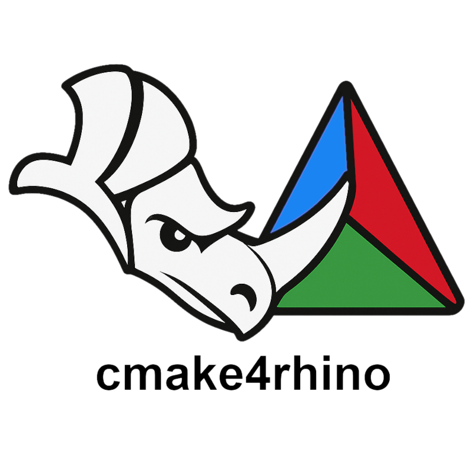

<p align="center">
    
</p>
<!-- <p align="center">
    
</p> -->


### Content

This is a simple [CMake](https://cmake.org/) template for [Rhino plugins](https://developer.rhino3d.com/guides/cpp/), to quickly set up a new C++ project.
It is tested to work with Rhino 8 and 7 SDKs, VSCode. All contributions are welcome!

The template is distributed as a [cookiecutter](https://github.com/cookiecutter/cookiecutter) template, which can be used to generate a new project with the desired name and settings. Have fun cmakers!

<br>

| Check                        | Status |
|------------------------------|:------:|
| Downloadable Template  |  |


### Quickstart


### Resources:

-- https://discourse.mcneel.com/t/cmakelists-rhino-plugin-c/144188/16 thread for cmake in rhino

- MFC is needded to be isntalled via Visual Studio Installer
### to build:

for debug build:
```bash
❯ cmake -S . -B build -G "Visual Studio 17 2022" -A x64 -DRHINO_DEBUG_PLUGIN=ON; cmake --build build --config Debug
```

```bash
❯ Remove-Item --Recurse -Force build; cmake -S . -B build -G "Visual Studio 17 2022" -A x64; cmake --build build --config Release
```

Notes:
- `RHINO8SDK_PATH` can be set to the path of the Rhino SDK, or it will try to find it in the default location.
- It supports Rhino 8 and 7 SDK.
- Specify the the config Debug or Release needss to be eexplicitly set in `cmake --build build --config Debug` or `cmake --build build --config Release`.

### todo:
- [ ] test CI
- [ ] do the coockiecutter
