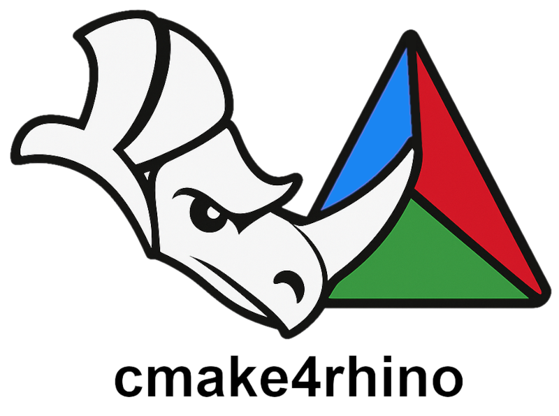

<p align="center">
    
</p>
<!-- <p align="center">
    
</p> -->


### What is this?

This is a [CMake](https://cmake.org/) template for [Rhino plugins](https://developer.rhino3d.com/guides/cpp/), to quickly set up a new C++ project.
It is tested to work with Rhino 8 and 7 SDKs, VSCode and MSVC 2019 and 2022 . All contributions are welcome!

The template is distributed as a [cookiecutter](https://github.com/cookiecutter/cookiecutter) template, which can be used to generate a new project with the desired name and settings. Have fun cmakers!

<br>

##### Supported Toolchains & Platforms:

<table width="100%">
  <tr style="background-color:#f6f8fa;">
    <th>OS</th>
    <th>Generator / Compiler</th>
    <th>Rhino SDK</th>
    <th>CMake</th>
  </tr>
  <tr>
    <td style="text-align:center;">
    
    Windows
    </td>
    <td style="text-align:center;">Visual Studio 16 2019  <br> Visual Studio 17 2022 </td>
    <td style="text-align:center;">Rhino 6  <br> Rhino 7  <br> Rhino 8 </td>
    <td style="text-align:center;">3.15+ </td>
  </tr>
</table>

<!-- TODO: add the badge for the CI building for the cmake project -->
##### CI status:

<table width="100%">
  <tr style="background-color:#f6f8fa;">
    <th>Name</th>
    <th>Build Status</th>
    <th>Branch</th>
    <th>Notes</th>
  </tr>
  <tr>
    <td style="text-align:center;">Downloadable Template</td>
    <td style="text-align:center;">
      <a href="https://github.com/9and3/cmake4rhino/actions/workflows/build_cookietemplate.yml">
        
      </a>
    </td>
    <td style="text-align:center;">
      <a href="https://github.com/9and3/cmake4rhino/tree/cookietemplate">cookietemplate</a>
    </td>
    <td style="text-align:center;">
      <code>cookiecutter gh:9and3/cmake4rhino --checkout cookietemplate</code>
    </td>
  </tr>
  <tr>
    <td style="text-align:center;">CMake/VS17-2022/Rhino8SDK build</td>
    <td style="text-align:center;">
      <a href="https://github.com/9and3/cmake4rhino/actions/workflows/build_cmake.yml">
        
      </a>
    </td>
    <td style="text-align:center;">
      <a href="https://github.com/9and3/cmake4rhino/tree/Main">Main</a>
    </td>
    <td style="text-align:center;">
      <code>..</code>
    </td>
  </tr>
</table>

<br>

### Quickstart

#### Download the template

You can download the template with the following command in a terminal:

```bash
pip install cookiecutter
cookiecutter gh:9and3/cmake4rhino --checkout cookietemplate
```
When asked, change the project name with your plug-in name.

#### Project information
The remaining information to change can be found in the `CMakeLists.txt` file to be filled with your project information, such as the name, version, author, etc:

https://github.com/9and3/cmake4rhino/blob/5d0722a11a8476ff51b25dceda3b8a25a282155d/CMakeLists.txt#L20-L31

#### Logo
The logo should be replaced in the `res/` folder with your own (remember 256-pixel square `.ico` file).

#### Compile

Check-in your folder:
```bash
cd <your-genereated-project-folder>
```
For debug build
```bash
cmake -S . -B build -G "Visual Studio 17 2022" -A x64 -DRHINO_DEBUG_PLUGIN=ON; cmake --build build --config Debug
```

```bash
cmake -S . -B build -G "Visual Studio 17 2022" -A x64 -DRHINO_DEBUG_PLUGIN=ON; cmake --build build --config Release
```

Flags:
- `-DMFC_ROOT=<path_to_mfc>`: Path to the MFC library, if not set it will try to find it in the default location.
- `-DRHINO8SDK_ROOT=<path_to_rhino8_sdk>`: Path to the Rhino 8 SDK, if not set it will try to find it in the default location.
- `-DRHINO_EXE_PATH=<path_to_rhino_exe>`: Path to the Rhino executable, if not set it will try to find it in the default location.
- `-DRUN_POSTBUILD_RHINO=ON`: Enable to automatically open RHino and install the plugin after building.